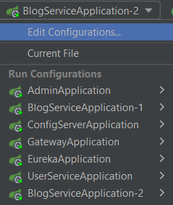
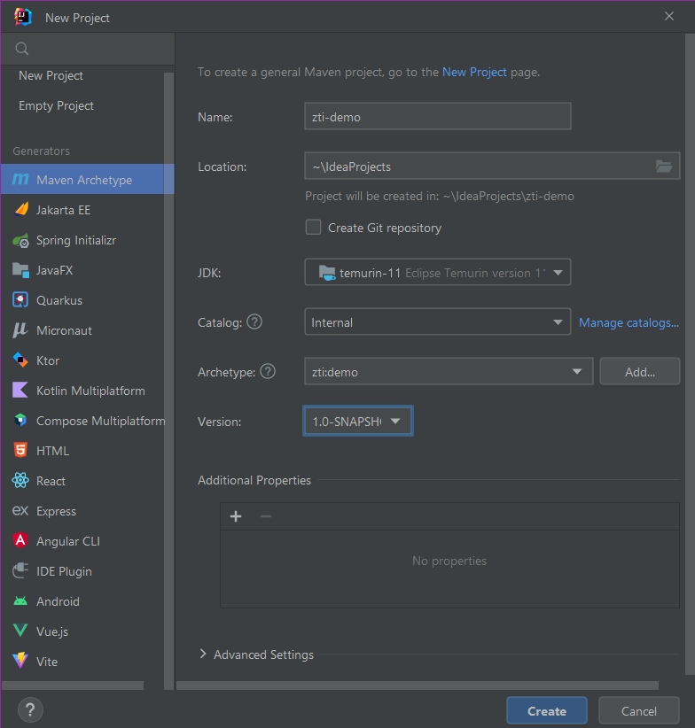
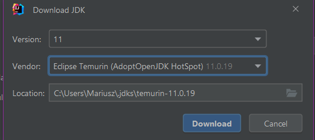
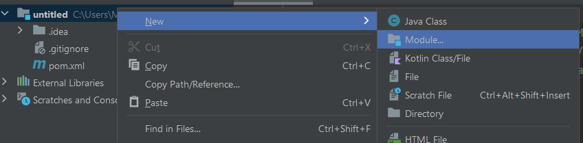
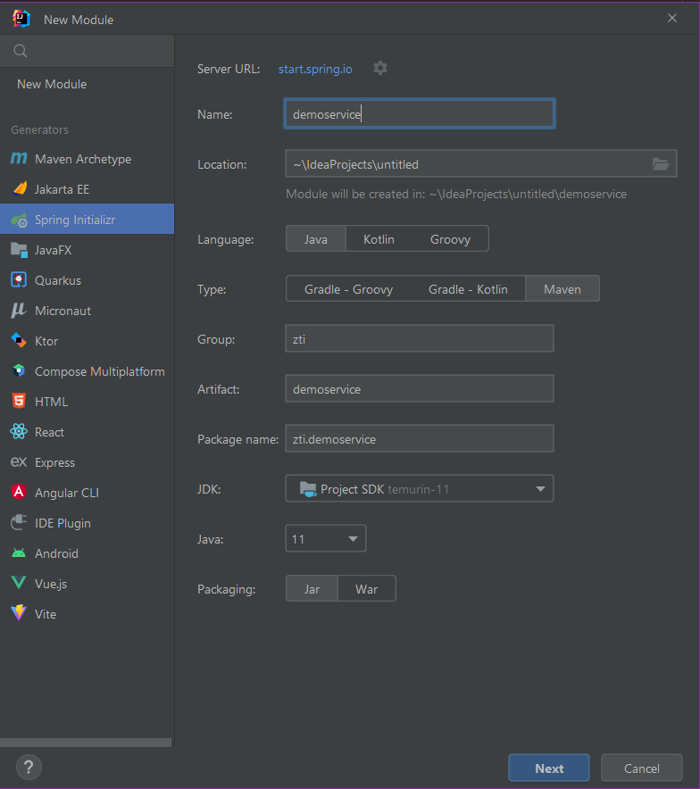

# Prezentacja Spring Cloud

## Poradnik uruchomienia

### Klonowanie repozytorium

By sklonować repozytorium, w przygotowanym folderze uruchom komendę

`git clone https://github.com/MonikaK/zti-seminar.git`

### Startowanie aplikacji

Należy kliknąć na odpowiednią usługę i odpalić ją zielonym przyciskiem "Start"  

**Usługi należy włączać w odpowiedniej kolejności!**
1. Admin
2. Eureka
3. ConfigServer
4. Gateway
5. inne...

### Gdzie są usługi?

AdminServer - http://localhost:8099  
Eureka - http://localhost:8761  
ConfigServer - http://localhost:8012  
Gateway - http://localhost:8084  
UserService - http://localhost:8081  
BlogService - port jest losowany dla każdej instancji  

Przez Gateway można przejsć do usług UserService (/user-service) i BlogService (/blog-service).  

### BlogService

- /blog-service/info - drukowanie pobranego property z ConfigServera
- /blog-service/hello - wyświetlenie losowego id (inne dla każdej instancji)
- /blog-service/blogs - wyświetlenie listy blogów z bazy ElephantSQL

### UserService

- /user-service/info - drukowanie pobranego property z ConfigServera
- /user-service/hello - wyświetlenie id usługi
- /user-service/users - wyświetlenie listy osób z bazy ElephantSQL

## Samodzielne stworzenie projektu

### Rozpoczęcie projektu

W oknie File -> New -> Project ustaw następujące opcje:  
  
W przypadku braku JDK 11 na komputerze wciśnij `Download JDK` i ustaw, tak jak pokazano poniżej:  

### Dodawanie nowych modułów

Dodawanie nowych modułów:  
  
  

### Startowanie aplikacji

Podobnie jak w Poradniku Uruchomienia wyżej
